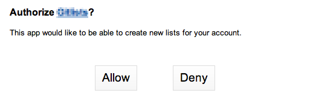

Authentication
==============

Any use of the Fiesta API is done using an **API client**. You might
have a client set up for your company or for an individual
project. Each client has a set of **client credentials**: a **client
id** and a **client secret**. Those credentials are presented to
Fiesta to authenticate your client.

To get client credentials to use for your application contact
`api@corp.fiesta.cc <mailto:api@corp.fiesta.cc>`_.

The Fiesta API has two levels of authentication: **client auth** and
**user auth**. Client auth uses your client credentials to prove the
identity of your client to Fiesta. User auth is used when you want to
access resources on behalf of a specific user: you need to both prove
the identity of your client *and* prove that the user has given your
client permission to act on their behalf. We'll talk about each type
of auth in detail below.

OAuth
-----

Fiesta uses a recent draft of the `OAuth 2.0
<http://tools.ietf.org/html/draft-ietf-oauth-v2-21>`_ protocol for
authentication. We intend to update the API to use final versions of
both the OAuth 2.0 and `bearer tokens
<http://tools.ietf.org/html/draft-ietf-oauth-v2-bearer-08>`_ standards
as they are released.

If you've never worked with OAuth before, just skip ahead to
:ref:`client-auth`. If you're already an OAuth expert, here are some
high-level details about Fiesta's OAuth implementation:

Supported Grant Types

  Fiesta supports authorization code, client credentials and 
  refresh token grants.

User Authorization Endpoint

  When requesting user authorization, use ``https://fiesta.cc/authorize``.

Token Endpoint

  When requesting token credentials, use ``https://api.fiesta.cc/token``.

.. _client-auth:

Client Auth
-----------

Client auth allows your API client to access resources on behalf of
itself. Let's go through an example - we'll access the resource
:http:get:`/hello/client`:

.. http:get:: /hello/client

   Say "hello" to an API client. Requires :ref:`client-auth`.

First, let's try it without any authentication just like we did with
:http:get:`/hello`:

.. code-block:: console

  $ curl -i https://api.fiesta.cc/hello/client
  HTTP/1.1 401 UNAUTHORIZED
  WWW-Authenticate: Basic realm="fiesta"
  Content-Length: 98

  {"status": {"code": 401}, "error_description": "No client credentials", "error": "invalid_client"}

We get a **401 UNAUTHORIZED** response: we need client auth to access
the resource. The simplest way to use client auth is by including our
credentials using `HTTP Basic Auth <http://www.ietf.org/rfc/rfc2617.txt>`_
or URL parameters. Let's try Basic Auth first (replace *CLIENT_ID* and
*CLIENT_SECRET* with your client credentials here and throughout the
rest of this document):

.. code-block:: console

  $ curl --user CLIENT_ID:CLIENT_SECRET  -i https://api.fiesta.cc/hello/client
  HTTP/1.1 200 OK
  Content-Type: application/json

  {
    "hello": "Your Client Name"
  }

If it's easier we can use URL parameters instead:

.. code-block:: console

  $ curl -i 'https://api.fiesta.cc/hello/client?client_id=CLIENT_ID&client_secret=CLIENT_SECRET'
  HTTP/1.1 200 OK
  Content-Type: application/json

  {
    "hello": "Your Client Name"
  }

That's pretty much all there is to it! If you're an OAuth nerd we also
support the client credentials grant workflow. We think the above
methods are a bit easier to work with, but if you'd rather use the
OAuth flow we support the spec (no need to read on if you're happy
with the Basic Auth / URL parameters methods described above).

First use your client credentials to get a token:

.. code-block:: console

  $ curl --user CLIENT_ID:CLIENT_SECRET --data "grant_type=client_credentials" -i https://api.fiesta.cc/token
  HTTP/1.1 200 OK
  Content-Type: application/json;charset=UTF-8

  {"access_token": "...", "token_type": "bearer", "expires_in": 3600}

To get the token, we *POST* to ``https://api.fiesta.cc/token``. We
specify the **grant_type** as "client_credentials", and include our
client credentials using HTTP Basic Auth. Instead of using Basic Auth,
we could have included the credentials by including `client_id` and
`client_secret` parameters as POST data or in the query string.

The response is JSON. The important bit is the **access_token**
field - let's use it to try our :http:get:`/hello/client` request again
(replace *ACCESS_TOKEN* with the token from the above response):

.. code-block:: console

  $ curl -H "Authorization: Bearer ACCESS_TOKEN" -i https://api.fiesta.cc/hello/client
  HTTP/1.1 200 OK
  Content-Type: application/json

  {
    "hello": "Your Client Name"
  }

Now that we have included the access token our request works as
expected. We can continue to use the same token until it expires
(we'll get a **401 UNAUTHORIZED** when trying to use it), at which
point we just repeat the above process to get a new token.

.. _user-auth:

User Auth
---------

User auth is required when accessing resources on behalf of a Fiesta
user. At a high level, it works the same way as client auth using the
OAuth flow: you get a token and then include that token in the
*Authorization* header when accessing the protected resource. The
difference is in the process of acquiring the token to use - we need
to get permission from the user in question.

.. note:: To use user auth, your client needs to specify a *Redirect
   URI*. This is the URI that Fiesta will redirect the user to after
   they authorize your application. To set a Redirect URI, visit `the
   settings page <https://fiesta.cc/settings>`_ and click on the
   "Manage" link for your client.

Let's run through an example - we'll access the resource (you guessed
it) :http:get:`/hello/user`:

.. http:get:: /hello/user

   Say "hello" to the authenticated user. Requires :ref:`user-auth`
   with "read" scope.

First, let's try it without any authentication:

.. code-block:: console

  $ curl -i https://api.fiesta.cc/hello/user
  HTTP/1.1 401 UNAUTHORIZED
  WWW-Authenticate: Bearer realm="fiesta"
  Content-Length: 0

Let's see what happens if we try using :ref:`client-auth`, too:

.. code-block:: console

  $ curl --user CLIENT_ID:CLIENT_SECRET -i https://api.fiesta.cc/hello/user
  WWW-Authenticate: Bearer realm="fiesta", error="invalid_token", error_description="User authentication required"
  Content-Length: 0

Now that we've seen it go wrong, let's try doing it the right way - by
getting a user auth token. The first step is to redirect the user to
the authorization endpoint, including our client_id and
``response_type=code`` as parameters. The fully constructed URL is
``https://fiesta.cc/authorize?response_type=code&client_id=CLIENT_ID``.

.. note:: If you only need specific scopes, you can include a `scope`
   parameter here as well with a comma delimited list of scopes for
   the value - the default is to request all available scopes. Each
   documented endpoint will name the scope that it requires.

When they are redirected, the user will see a screen like this:

If the user clicks "Deny" they will be redirected to your Redirect
URI. Fiesta will add the parameter ``error=access_denied`` to the
URI's query string, so you'll know the request was denied.

If the user clicks "Accept" they will be also be redirected to the
Redirect URI. In this case, however, the query string will include a
**code** parameter, which we can exchange for an access token (replace
*CODE* with the code you receive):

.. code-block:: console

  $ curl --user CLIENT_ID:CLIENT_SECRET --data "grant_type=authorization_code&code=CODE" -i https://api.fiesta.cc/token
  HTTP/1.1 200 OK
  Content-Type: application/json;charset=UTF-8

  {"access_token": "...", "refresh_token": "..." "token_type": "bearer", "expires_in": 3600, "scope": "..."}

.. note:: See :ref:`refresh-token` for generating new user access tokens
   when the original expires and the user is offline.

Now, let's use the access token to try our request for ``/hello/user``
again (replace *ACCESS_TOKEN* with the value you received above):

.. code-block:: console

  $ curl -H "Authorization: Bearer ACCESS_TOKEN" -i https://api.fiesta.cc/hello/user
  HTTP/1.1 200 OK
  Content-Type: application/json

  {
    "hello": "User Name"
  }

That's it! You now have permission to access resources on the user's behalf.

Hinting
-------

If you already know the email address of the user whose authorization
you're requesting, you can provide it as a *hint* to Fiesta. Hinting
makes the authorization flow a little simpler for the user. To hint,
just include the email address as the value of the ``hint`` query
parameter when redirecting the user to ``/authorize``.

Expired Token
-------------

If your token expires there are two ways to be granted a fresh token. The
first is redirecting the user's browser back to Fiesta's ``/authorize`` endpoint.
Re-authorization in this way won't actually require any user
input: once they are redirected to the authorization endpoint the user
will be immediately redirected back to your Redirect URI.

If a user is offline then you'll need to use a :ref:`refresh-token` to
get a fresh access token. This requires "offline" scope.

.. _refresh-token:

Refresh Token
-------------

User access tokens expire within a few hours of being granted. If your
application needs to take action on behalf of a user that is offline,
you should request the "offline" scope. If your application is granted
"offline" scope, whenever you get an access token the response also
contains a ``refresh_token``. The refresh token can be exchanged for a
fresh user access token at any time.

.. code-block:: console

   $ curl --user CLIENT_ID:CLIENT_SECRET --data "grant_type=refresh_token&refresh_token=REFRESH_TOKEN" -i https://api.fiesta.cc/token
   HTTP/1.1 200 OK
  Content-Type: application/json;charset=UTF-8

  {"access_token": "...", "refresh_token": "..." "token_type": "bearer", "expires_in": 3600, "scope": "..."}

.. note:: For security reasons refresh tokens must be discarded after
   being used. A new refresh token is included in the response and
   must be used the next time you want a fresh user access token.

Refresh tokens can be exchanged indefinitely, unless a user revokes
access for your application.

Revoked Tokens
--------------

If the user revokes your client's access your API requests will return
**401 UNAUTHORIZED**, and you'll need to re-authorize:

.. code-block:: console

  $ curl -H "Authorization: Bearer ACCESS_TOKEN" -i https://api.fiesta.cc/hello/user
  HTTP/1.1 401 UNAUTHORIZED
  WWW-Authenticate: Bearer realm="fiesta", error="invalid_token", error_description="Revoked token"

Other Information
-----------------

There are more options that can be passed as parameters to the
authorization endpoint: see the `OAuth 2.0
<http://tools.ietf.org/html/draft-ietf-oauth-v2-21>`_ draft for full
details. One parameter that might be useful is `state`. If you include
a `state` parameter when redirecting the user, that same parameter
will be included when the user is redirected back to your Redirect
URI.
